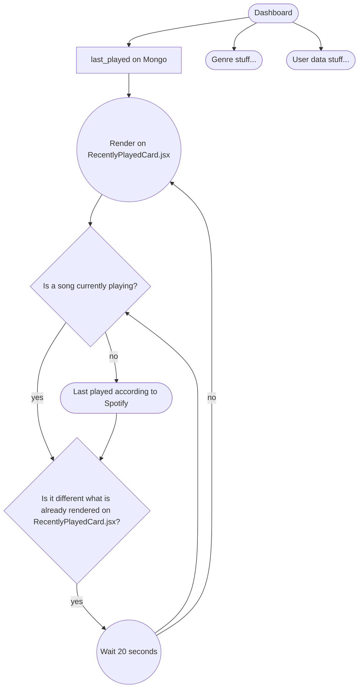

```mermaid
graph TD

dash([Dashboard])
last[last_played on Mongo]
render((Render on RecentlyPlayedCard.jsx))
current{Is a song currently playing?}
spotify([Last played according to Spotify])
dedup{Is it different what is already rendered on RecentlyPlayedCard.jsx?}

genres([Genre stuff...])
wait((Wait 20 seconds))
user([User data stuff...])

dash --> last
dash --> genres
dash --> user
last --> render
render --> current
current -- yes --> dedup
current -- no --> spotify
spotify --> dedup
wait -- no --> render
dedup -- yes --> wait
wait --> current


```