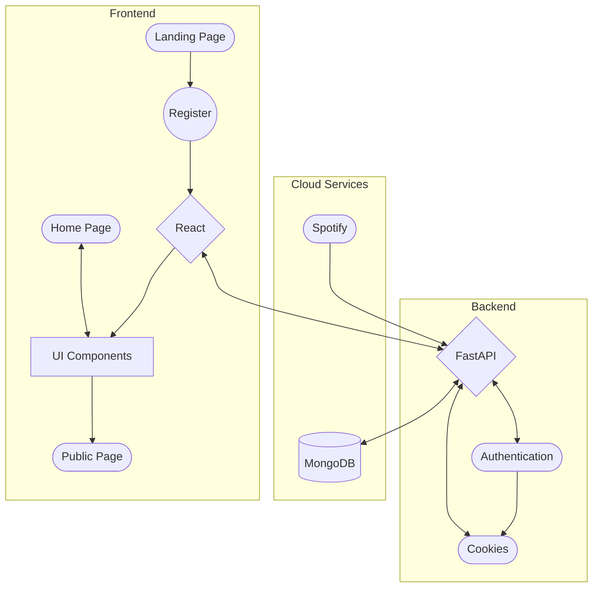

```mermaid
graph TD
subgraph Backend
    api{FastAPI}
    cookie([Cookies])
    auth([Authentication])
    
end

subgraph Cloud Services
    db[(MongoDB)]
    spotify([Spotify])
end


subgraph Frontend
    landing([Landing Page])
    ui[UI Components]
    register((Register))
    react{React}
    
    home([Home Page])
    
    public([Public Page])
    
end

landing --> register
register --> react
ui --> public
home <--> ui
api <--> cookie
auth --> cookie
react <--> api
api <--> db
spotify --> api
react --> ui
api <--> auth
```