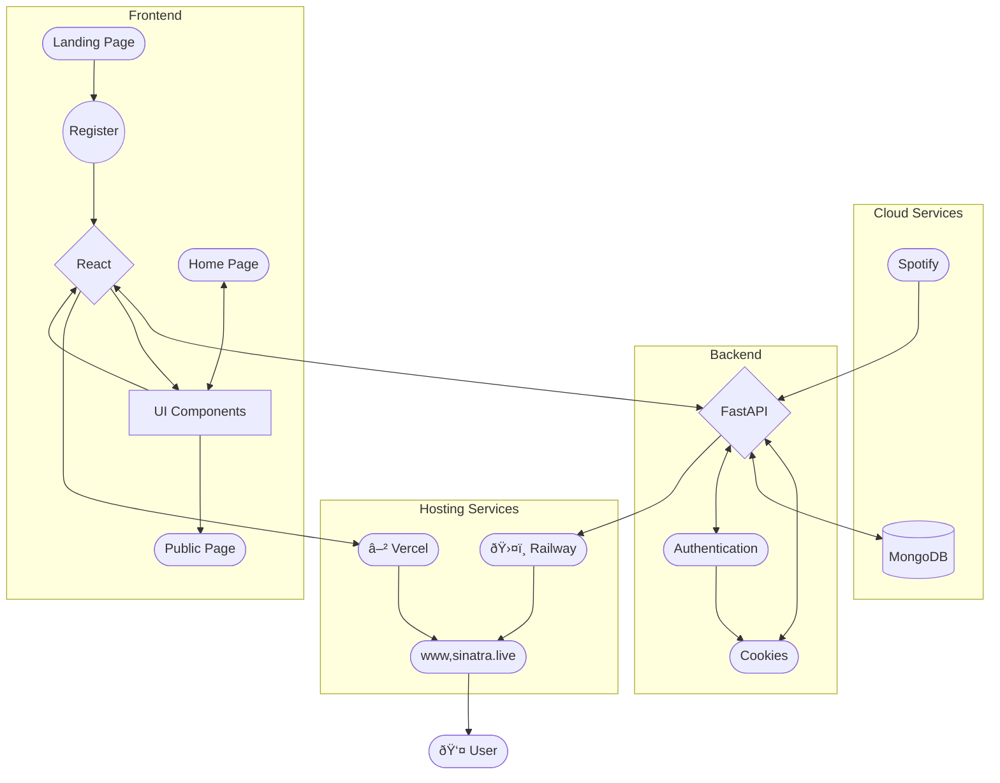

```mermaid
graph TD
subgraph Hosting Services
    vercel([â–² Vercel])
    railway([ðŸ›¤ï¸ Railway])
    web([www,sinatra.live])
end

user([👤 User])

subgraph Backend
    api{FastAPI}
    cookie([Cookies])
    auth([Authentication])
end

subgraph Cloud Services
    db[(MongoDB)]
    spotify([Spotify])
end


subgraph Frontend
    landing([Landing Page])
    ui[UI Components]
    register((Register))
    react{React}
    
    home([Home Page])
    
    public([Public Page])
    
end

landing --> register
register --> react
ui --> public
home <--> ui
api <--> cookie
auth --> cookie
react <--> api
api <--> db
spotify --> api
react --> ui
api <--> auth
ui --> react
api --> railway
react --> vercel
vercel --> web
railway --> web
web --> user
```